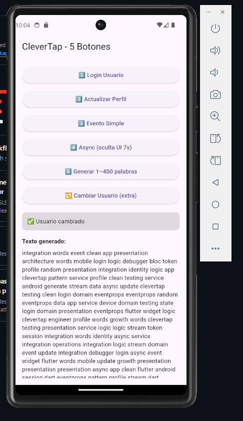
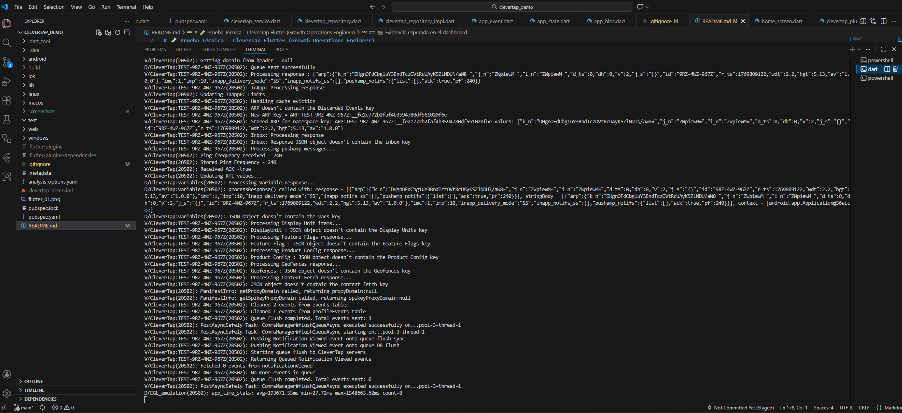
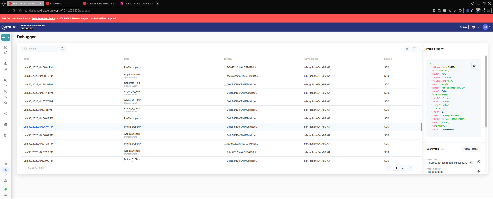

# 🧪 Prueba Técnica – CleverTap Flutter (Growth Operations Engineer)

Este proyecto demuestra una integración completa del SDK de **CleverTap** en una aplicación Flutter utilizando **Clean Architecture + BLoC + Repository Pattern**.

El objetivo de esta implementación es cumplir y evidenciar claramente los requerimientos de una prueba técnica orientada a **Growth / Analytics / Mobile Tracking**, mostrando buenas prácticas de arquitectura, trazabilidad de eventos y correcta comunicación con el dashboard de CleverTap.

---

## 🎯 Objetivos que cumple este proyecto

Con esta app se demuestra:

- ✅ Login de usuario con identidad única
- ✅ Actualización de propiedades de perfil
- ✅ Envío de eventos simples
- ✅ Envío de eventos con propiedades dinámicas
- ✅ Manejo de flujos asíncronos (delay controlado de 7s)
- ✅ Generación dinámica de datos (1–400 palabras aleatorias)
- ✅ Cambio de usuario en caliente (nueva identidad)
- ✅ Arquitectura escalable desacoplada del SDK
- ✅ Visualización en tiempo real en CleverTap Debugger

---

## 🧱 Arquitectura del proyecto

Se implementó una arquitectura limpia y desacoplada:

```
lib/
├─ data/
│   ├─ clevertap_service.dart
│   └─ clevertap_repository_impl.dart
│
├─ domain/
│   └─ clevertap_repository.dart
│
├─ bloc/
│   ├─ app_bloc.dart
│   ├─ app_event.dart
│   └─ app_state.dart
│
├─ presentation/
│   └─ home_screen.dart
│
└─ main.dart
```

### ¿Por qué esta arquitectura?

Porque en entornos de Growth y Analytics:

- El SDK no debe mezclarse con la UI
- Los eventos deben poder cambiar sin afectar pantallas
- Es necesario poder testear la lógica sin depender del SDK
- Permite escalar a múltiples fuentes de tracking (Firebase, Mixpanel, etc.)

---

## 🕹 Funcionalidad de los botones

| Botón | Acción | Resultado en CleverTap |
|------|-------|--------------------------|
| 1️⃣ Login Usuario | onUserLogin con identidad | `Identity Set` + propiedades |
| 2️⃣ Actualizar Perfil | profileSet con DOB, ciudad, profesión | `Profile Property` |
| 3️⃣ Evento Simple | recordEvent sin props | Evento `Boton_3_Click` |
| 4️⃣ Async 7s | Oculta UI 7s y registra inicio/fin | `Async_UI_Start` y `Async_UI_End` |
| 5️⃣ Generar Texto | Genera 1–400 palabras y envía props | Evento `Generate_Text` |
| 6️⃣ Cambiar Usuario | Nuevo login con otra identidad | Nuevo perfil en CleverTap |

---

## 🛠 Requisitos

Antes de correr el proyecto necesitas tener instalado:

- Flutter SDK
- Android Studio (SDK + Emulator)
- VS Code o IDE
- Cuenta en CleverTap
- Dispositivo Android o emulador

Verificar:

```
flutter doctor
```

---

## ⚙️ Configuración de CleverTap

Editar:

```
android/app/src/main/AndroidManifest.xml
```

Agregar tus credenciales:

```xml
<meta-data android:name="CLEVERTAP_ACCOUNT_ID" android:value="TU_ACCOUNT_ID"/>
<meta-data android:name="CLEVERTAP_TOKEN" android:value="TU_TOKEN"/>
<meta-data android:name="CLEVERTAP_REGION" android:value="eu1"/>
```

---

## ▶️ Cómo ejecutar

```
flutter pub get
flutter run
```

### En dispositivo físico

1. Activar USB Debugging
2. Conectar el celular
3. Verificar con:

```
flutter devices
```
4. Ejecutar:

```
flutter run
```

---

## 🔎 Cómo validar en CleverTap

1. Ir al Dashboard
2. Abrir **Debugger**
3. Presionar los botones
4. Buscar eventos:

- Boton_3_Click
- Generate_Text
- Async_UI_Start
- Async_UI_End
- Identity Set
- Profile Property

---

## 📦 Dependencias principales

```yaml
clevertap_plugin: ^3.6.0
flutter_bloc: ^9.1.1
equatable: ^2.0.8
```

---

## 🧠 Buenas prácticas demostradas

- Separación total del SDK
- Manejo de estados con BLoC
- Prevención de doble envío de eventos
- Logs claros para debugging
- Estructura preparada para escalar tracking

---

## 📸 Evidencia esperada en el dashboard

Después de usar la app deberías ver:

- Nuevos perfiles creados
- Propiedades actualizadas
- Eventos con y sin propiedades
- Sesiones distintas por usuario

---

## 🧩 Conclusión

Este proyecto no solo integra CleverTap, sino que demuestra cómo hacerlo de forma profesional, escalable y alineada a roles de Growth Operations y Mobile Analytics.

---

## 📸 Evidencia visual de funcionamiento

### 1️⃣ App con los 5 botones


### 2️⃣ Consola Flutter enviando eventos a CleverTap


### 3️⃣ Login de usuario reflejado en CleverTap (Profile Properties)


### 4️⃣ Eventos enviados con y sin propiedades


### 5️⃣ Demo asíncrona (UI oculta 7s)


### 6️⃣ Generación dinámica de texto (1–400 palabras)


## 👤 Autor

Erick David Anaya

